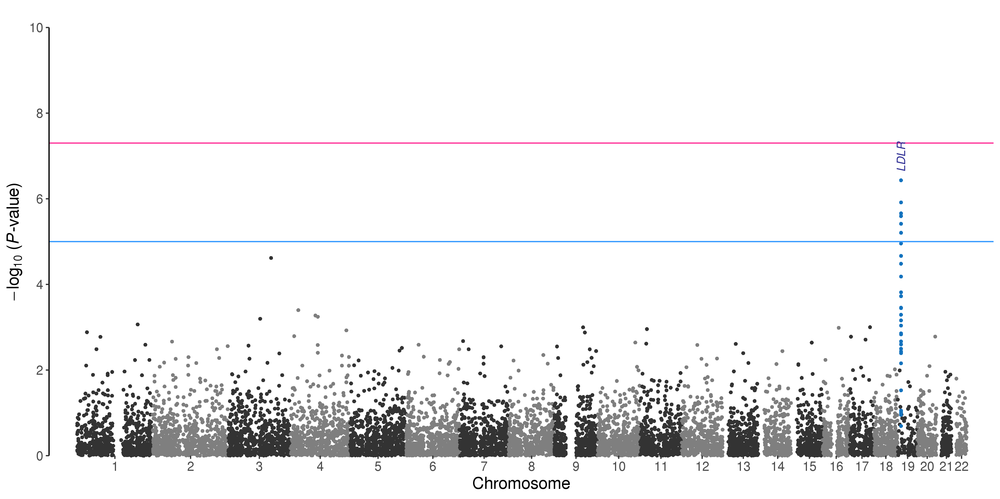
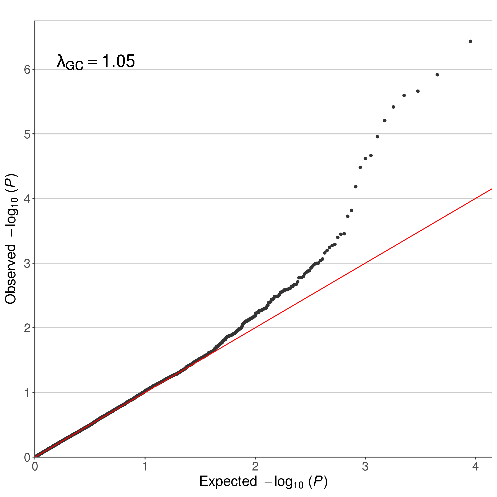
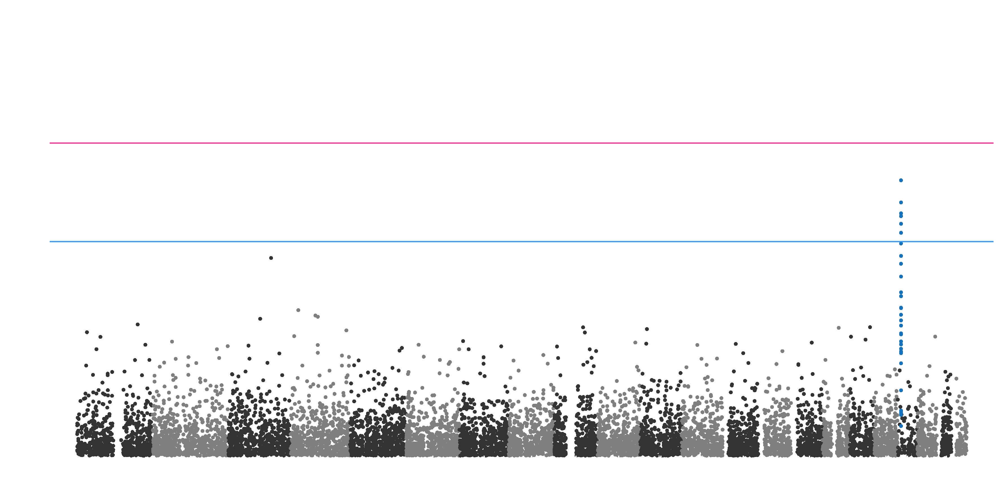
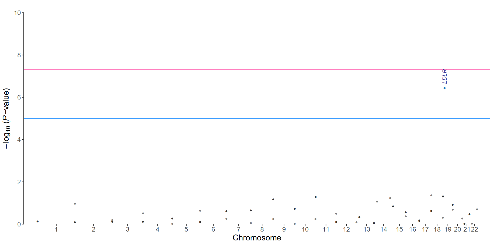

# ManhattanGG
---

Manhattan and Q-Q plot script using the "ggplot" package in R

<br>

## Overview
---

## Dependencies
---

- R packages
	-	ggplot2
	-	ggrepel
	-	scales
	-	argparse
	-	data.table
	-	stringr

<br>

## Simple examples
___

Example scripts and materials are in the `./example` directory.

- Display all options
```
Rscript ManhattanGG.R --help
```

- Materials for following examples
	- Script file for basic usage: `./example/01_run.manNqq.sh`
	- Script file for paper materials: `./example/02_run.paper_materials.sh`
	- GWAS results file: `./example/example.glm.linear`
	- Decoration file: `./example.deco`

<br>

### 1. Basic usage

```
Rscript ../ManhattanGG.R --assoc example.glm.linear --qq --qq-lambda 1.05 --y-lim 10 \
                        --chr "#CHROM" --pos POS --snp ID --pval P \
                        --deco example.deco --deco-color color  --deco-label label --deco-label-color labelcolor \
                        --text-angle 90 \
                        --suggestiveline 1e-05 --point-size 1.2 \
                        --dark \
                        --out example
```

- options
	- `--assoc <filename>`: *GWAS results file*.
	- `--qq`: Plotting the Manhattan plot and Q-Q plot.
	- `--qq-lambda <number>`: Plotting λ (inflation factor) value on the Q-Q plot.
	- `--y-lim <-log10(P-value)>`: A limit for y axis.
	- `--chr`, `--pos`, `--snp`, `pval`: Column names for the chromosome, base position, marker ID and P-value in the *GWAS results file*, respectively.
	- `--deco <filename>`: *Decoration file*.
	- `--deco-color`, `--deco-label`, `--deco-label-color`: Column names for colors of highlighted points, text labels, and colors of the text label in the *Decoration file*.
	- `--text-angle <number>`: An angle for rotation of the text label.
	- `--suggestiveline <P-value>`: P-value threshold for suggestive significance. This horizontal line will be disappeared with `--suggestiveline no`.
	- `--point-size <number>`: point size.
	- `--out <prefix>`: Prefix for the output file name.

<br>

- results<br>
<U>Manhattan plot</U><br>
<br><br>
<U>Q-Q plot</U><br>
<p align="left"></p>

<br>
<br>

### 2. Paper materials

This option makes it easy to retouch using other image tools such as [Adobe Illustrator](https://www.adobe.com/products/illustrator.html?promoid=PGRQQLFS&mv=other).

```
Rscript ../ManhattanGG.R --assoc example.glm.linear --paper-material --y-lim 10 \
                        --chr "#CHROM" --pos POS --snp ID --pval P \
                        --deco example.deco --deco-color color  --deco-label label --deco-label-color labelcolor \
                        --text-angle 90 \
                        --suggestiveline 1e-05 --point-size 1.2 \
                        --dark \
                        --out example
```

- options
	- `--paper-material`: **ManhattanGG** returns following files with this option.
		- `<prefix>.manhattan.point.png`: PNG file with only points.
		- `<prefix>.manhattan.label.pdf`: PDF file with axis, labels and some reference points.

<br>

- results<br>
<U>point plot (.png)</U><br>
<br><br>
<U>label plot (.pdf)</U><br>


<br>
<br>

: : Remind : : &nbsp; All others options and default values for that options will be presented after following command.

```
Rscript ManhattanGG.R --help
```

